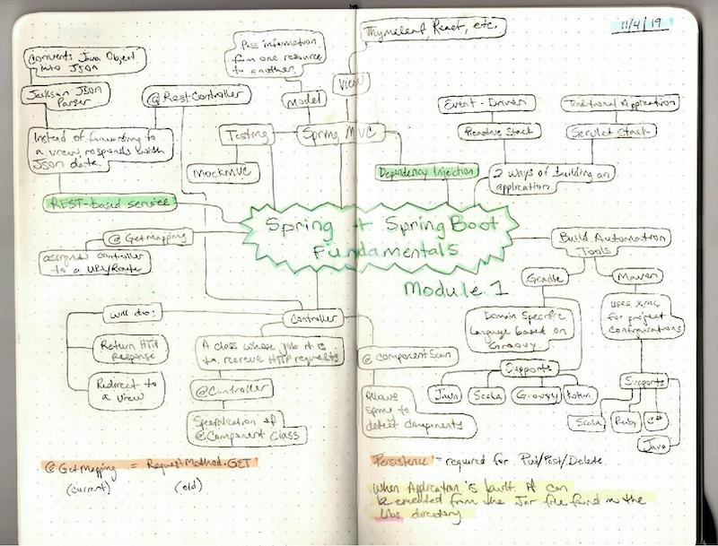

# Spring/SpringBoot Fundamentals - Module 1

## Module Tasks

* Create new app
* Importing into IDE
* Adding Controller
* Adding View
* Testing Controllers
* Creating REST web service
* Test REST components

